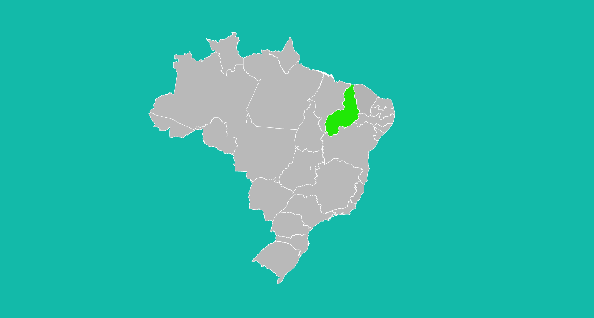

# 📌 Mapa Do Brasil

O objetivo inicial do projeto é fazer com que ao passar o mouse pelos estados do Brasil seja mudado a cor deles.

## 🚩 Prévia

## 📢 Avisos

Para executar o projeto em sua máquina você deve ter instalado o XAMPP, pois o projeto foi feito em PHP.

<a href="https://www.apachefriends.org/pt_br/index.html"> Download XAMPP </a>

## 📚 Materiais

- PHP (Hypertext Preprocessor)
- CSS (Cascading Style Sheet)
- JS (JavaScript)
- XAMPP (Apache MySQL PHP Pearl)

## 📁 Projeto
### 📍 Fazendo o clone do repositório:

    git clone https://github.com/brunnuscz/map-color.git

### 📍 Entrando no repositório baixado:

    cd map-color

### 📍 Acessando a página no navegador. Lembre de inicializar o Apache no XAMPP:

    http://localhost/map-color/index.php
